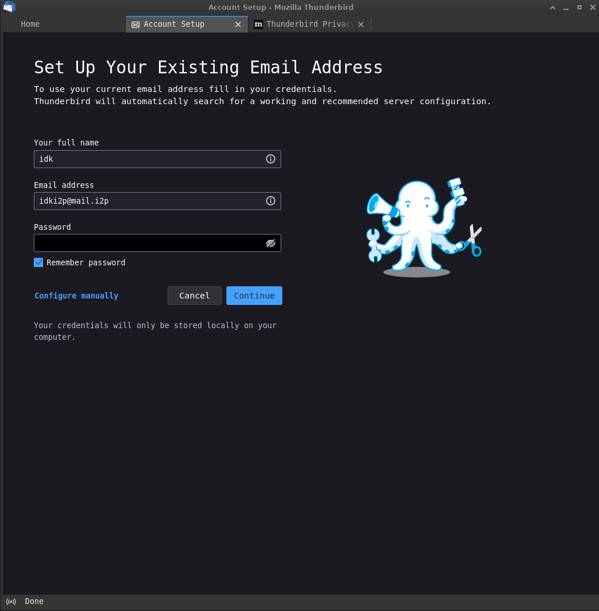
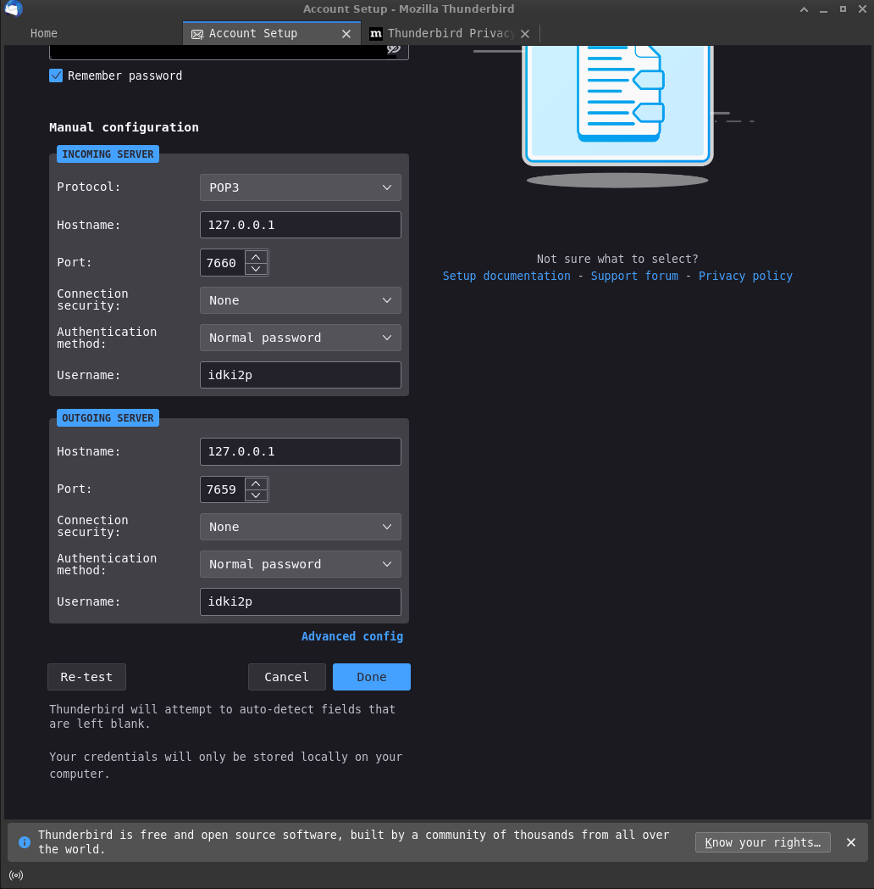
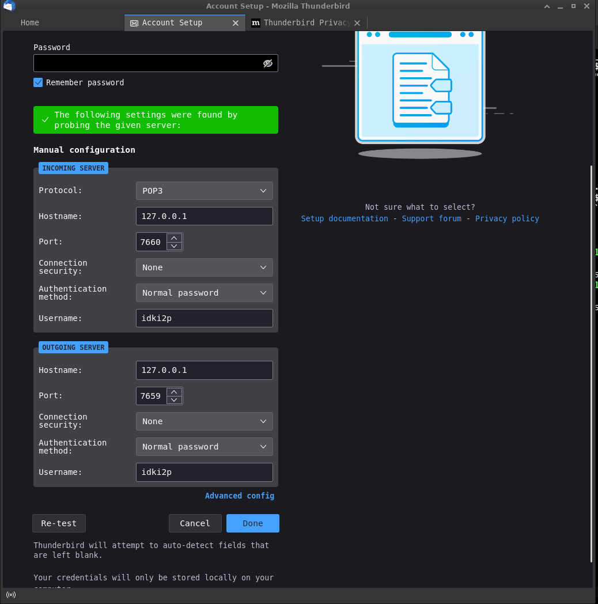
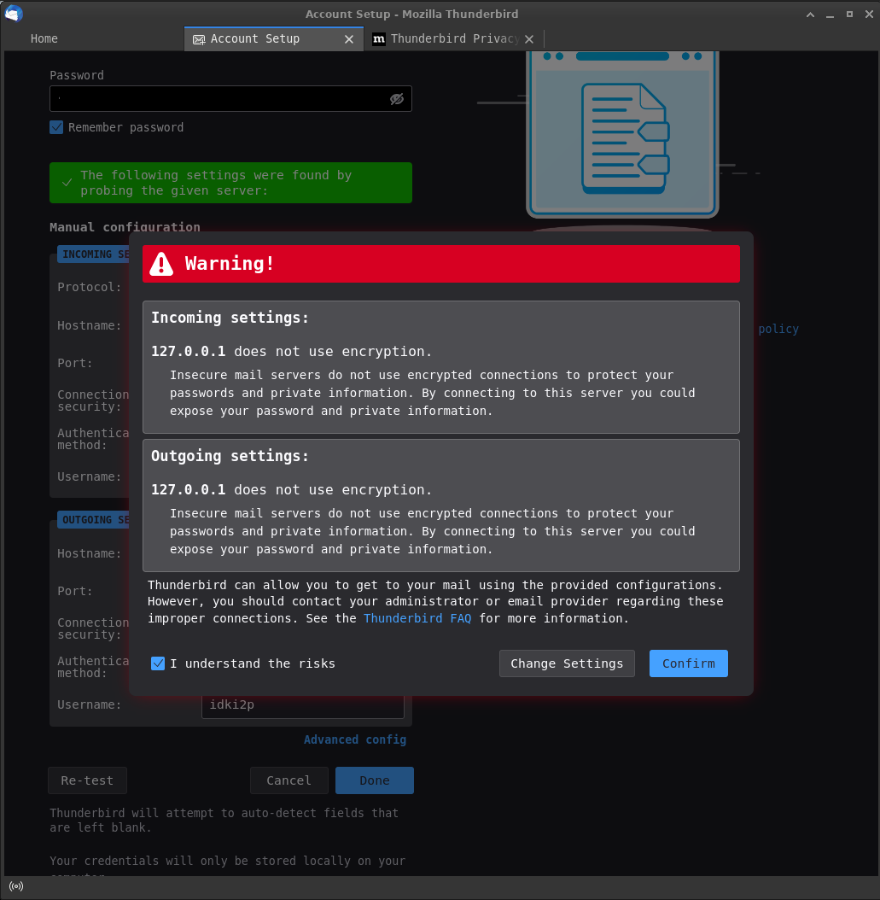
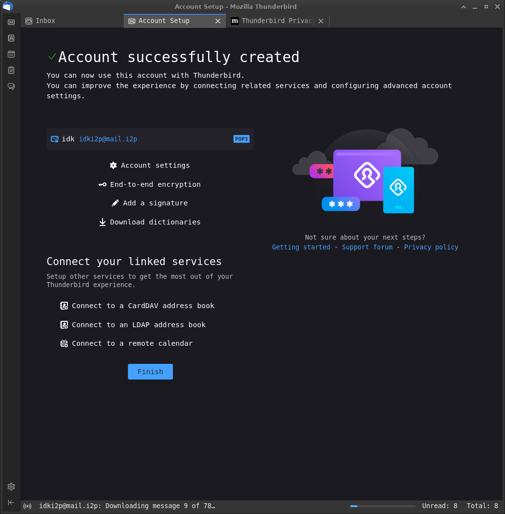

# Thunderbird-I2P-Configuration

A guide to configuring Thunderbird to use in-I2P mail with screenshots in stuff. May upstream to i2p.www if it's any good and I really can't do any better.

**1.** If this is the first time you're running Thunderbird, you will be greeted with this screen. Enter your I2P mail username and password, as shown below:



**2.** Once you have done that, you will need to enter the I2P settings. To do this, select "Enter Manually" from the panel, and fill in the correct values for the POP(Recieving e-mail) and SMTP(Sending e-mail) directories.**\***



**3.** After you do that, you **must** click "re-test" in order to proceed.



**4.** You will see a scary warning page, which you may ignore. I2P mail uses I2P for transport security



**5.** If you see this screen, you have successfully set up your email. 



## plain-text table of values:

```md
| Field:                       | Value:                  | Example:   |
+------------------------------+-------------------------+------------+
| Incoming Server              | Always POP              | POP        |
| Incoming Hostname            | Default 127.0.0.1       | 127.0.0.1  |
| Incoming Port                | Default 7660            | 7660       |
| Incoming Connection Security | Always None             | None       |
| Incoming Authentication      | Always Password         | trustno1   |
| Incoming Username            | Username w/o mail.i2p   | idki2p     |
+------------------------------+-------------------------+------------+

| Field:                       | Value:                  | Example:   |
+------------------------------+-------------------------+------------+
| Outgoing Server              | Always SMTP             | SMTP       |
| Outgoing Hostname            | Default 127.0.0.1       | 127.0.0.1  |
| Outgoing Port                | Default 7659            | 7659       |
| Outgoing Connection Security | Always None             | None       |
| Outgoing Authentication      | Always Password         | trustno1   |
| Outgoing Username            | Username w/o mail.i2p   | idki2p     |
+------------------------------+-------------------------+------------+
```